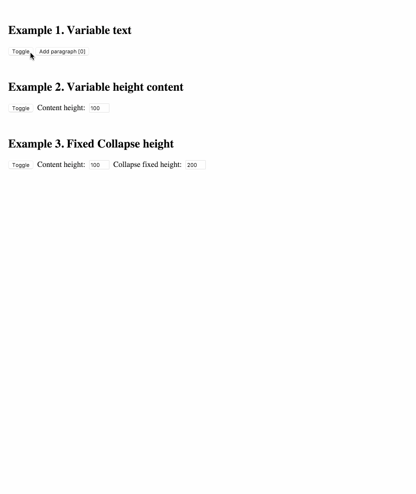

# react-collapse [](https://www.npmjs.com/package/react-collapse)

[](https://gitter.im/nkbt/help)

[](https://circleci.com/gh/nkbt/react-collapse)
[](https://ci.appveyor.com/project/nkbt/react-collapse)
[](https://codecov.io/github/nkbt/react-collapse?branch=master)
[](https://david-dm.org/nkbt/react-collapse)
[](https://david-dm.org/nkbt/react-collapse#info=devDependencies)

Component-wrapper for collapse animation with react-motion for elements with variable (and dynamic) height





## Installation

### NPM

```sh
npm install --save react react-motion react-collapse
```

Don't forget to manually install peer dependencies (`react`, `react-motion`) if you use npm@3.


### 1998 Script Tag:
```html
<script src="https://unpkg.com/react/dist/react.js"></script>
<script src="https://unpkg.com/react-motion/build/react-motion.js"></script>
<script src="https://unpkg.com/react-collapse/build/react-collapse.js"></script>
(Module exposed as `ReactCollapse`)
```


## Demo

[http://nkbt.github.io/react-collapse/example](http://nkbt.github.io/react-collapse/example)

## Codepen demo

[http://codepen.io/nkbt/pen/MarzEg](http://codepen.io/nkbt/pen/MarzEg?editors=101)

## Usage

Default behaviour, never unmounts content

```js
import {Collapse} from 'react-collapse';

// ...
<Collapse isOpened={true || false}>
  <div>Random content</div>
</Collapse>
```

If you want to unmount collapsed content, use `Unmount` component provided as:

```js
import {UnmountClosed} from 'react-collapse';

// ...
<UnmountClosed isOpened={true || false}>
  <div>Random content</div>
</UnmountClosed>
```

## Options


#### `isOpened`: PropTypes.boolean.isRequired

Expands or collapses content.


#### `children`: PropTypes.node.isRequired

One or multiple children with static, variable or dynamic height.

```js
<Collapse isOpened={true}>
  <p>Paragraph of text</p>
  <p>Another paragraph is also OK</p>
  <p>Images and any other content are ok too</p>
  
</Collapse>
```


#### `hasNestedCollapse`: PropTypes.bool (default: false)

If Collapse component has more Collapse components inside, it needs `hasNestedCollapse` to be set 
to avoid delayed animations. See https://github.com/nkbt/react-collapse/issues/76 for tech details.

```js
<Collapse isOpened={true} hasNestedCollapse={true}>
  <Collapse isOpened={true}>
    <div>Nested collapse</div>
  </Collapse>
  <Collapse isOpened={true}>
    <div>Nested collapse</div>
  </Collapse>
</Collapse>
```


#### `fixedHeight`: PropTypes.number

If content's height is known ahead it is possible pass optional `fixedHeight` prop with number of pixels.

```js
<Collapse isOpened={true} fixedHeight={100}>
  <div>Animated container will always expand to 100px height</div>
</Collapse>
```


#### `springConfig`: PropTypes.objectOf(PropTypes.number)

Custom config `{stiffness, damping, precision}` passed to the spring function (see https://github.com/chenglou/react-motion#--spring-val-number-config-springhelperconfig--opaqueconfig)

```js
import {presets} from 'react-motion';

<Collapse isOpened={true} springConfig={presets.wobbly}>
  <div>Wobbly animated container</div>
</Collapse>
```

```js
<Collapse isOpened={true} springConfig={{stiffness: 100, damping: 20}}>
  <div>Customly animated container</div>
</Collapse>
```

#### `forceInitialAnimation`: PropTypes.boolean

When initially opened, by default collapse content will be opened without animation, instantly. With this option set to `true` you can enforce initial rendering to be smoothly expanded from 0.
It is used internally in `Unmount` component implementation.


#### `theme`: PropTypes.objectOf(PropTypes.string)

It is possible to set `className` for extra `div` elements that ReactCollapse creates.

Example:
```js
<Collapse theme={{collapse: 'foo', content: 'bar'}}>
  <div>Customly animated container</div>
</Collapse>
```

Default values:
```js
const theme = {
  collapse: 'ReactCollapse--collapse',
  content: 'ReactCollapse--content'
}
```

Which ends up in the following markup:
```html
<div class="ReactCollapse--collapse">
  <div class="ReactCollapse--content">
    {children}
  </div>
</div>
```

NOTE: these are not style objects, but class names!


#### `onRest`: PropTypes.func

Callback function for animation finished from
[react-motion](https://github.com/chenglou/react-motion#--onrest---void).
It can be used to trigger any function after animation is done.

```js
<Collapse onRest={() => console.log(123)}>
  <div>Container text</div>
</Collapse>
```

#### `onMeasure`: PropTypes.func

Callback function for changes in height. Also passes measured width.
As an [example](https://github.com/nutgaard/react-collapse/blob/master/src/example/App/Hooks.js) it can be used to implement auto-scroll if content expand below the fold.

```js
<Collapse onMeasure={({height, width}) => this.setState({height, width})}>
  <div>Container text</div>
</Collapse>
```

#### `onRender`: PropTypes.func

Callback function for every re-render while animating.

Passes `current` height, as well as `from`/`to` heights.

**DANGEROUS** use with caution, may have huge performance impact if used improperly. Never do `setState` with it, since it is running while rendering and React will shoot Warning.
 
Possible usage: synchronous scrolling of some other component
```js
<Collapse onRender={({current, from, to}) => (this.anotherComponent.scrollTop = current)}>
  <div>Container text</div>
</Collapse>
```

#### Pass-through props

All other props are applied to a container that is being resized. So it is possible to pass `style` or `className`, for example.

```js
<Collapse isOpened={true}
  style={{width: 200, border: '1px solid red'}}
  className="collapse">

  <div>
    Animated container has red border, 200px width
    and has `class="collapse"`
  </div>
</Collapse>
```


## Behaviour notes

- initially opened Collapse elements will be statically rendered with no animation (see #19)
- it is possible to override `overflow` and `height` styles for Collapse (see #16), and ReactCollapse may behave unexpectedly. Do it only when you definitely know you need it, otherwise, never override `overflow` and `height` styles.


## Migrating from v2 to v3

1. Use named exports, it is a preferred way

  V2:
  ```js
  import Collapse from 'react-collapse';
  ```
  
  V3
  ```js
  import {Collapse} from 'react-collapse';
  ```
  
2. Default behavior changed to never unmount collapsed element. To actually unmount use extra provided component `UnmountCollapsed`

  V2: 
  ```js
  import Collapse from 'react-collapse';
  
  <Collapse isOpened={true || false}>
    <div>Random content</div>
  </Collapse>
  ```  

  V3: 
  ```js
  import {UnmountClosed as Collapse} from 'react-collapse';
  
  <Collapse isOpened={true || false}>
    <div>Random content</div>
  </Collapse>
  ```  

3. `onHeightReady` renamed to `onMeasure` which now takes object of shape `{width, height}`

  V2: 
  ```js
  <Collapse onHeightReady={height => console.log(height)}>
    <div>Random content</div>
  </Collapse>
  ```  

  V3: 
  ```js
  <Collapse onMeasure={({height, width}) => console.log(height, width)}>
    <div>Random content</div>
  </Collapse>
  ```  

4. Some new props/features: `hasNestedCollapse`, `forceInitialAnimation`, `onRender`, etc


## Development and testing

Currently is being developed and tested with the latest stable `Node 8` on `OSX`.

To run example covering all `ReactCollapse` features, use `yarn start`, which will compile `src/example/Example.js`

```bash
git clone git@github.com:nkbt/react-collapse.git
cd react-collapse
yarn install
yarn start

# then
open http://localhost:8080
```

## Tests

```bash
yarn test

# to generate test coverage (./reports/coverage)
yarn cov

# to run end-to-end smoketest
yarn e2e
```

## License

MIT
