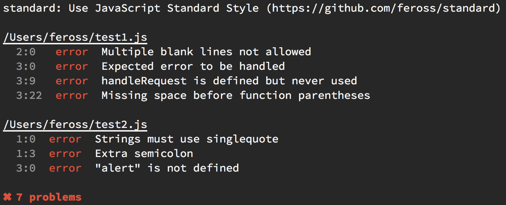
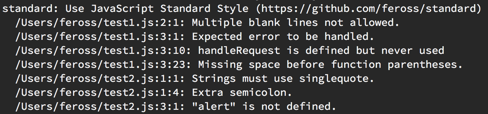

# snazzy [![travis][travis-image]][travis-url] [![npm][npm-image]][npm-url] [![downloads][downloads-image]][downloads-url]

[travis-image]: https://img.shields.io/travis/feross/snazzy.svg?style=flat
[travis-url]: https://travis-ci.org/feross/snazzy
[npm-image]: https://img.shields.io/npm/v/snazzy.svg?style=flat
[npm-url]: https://npmjs.org/package/snazzy
[downloads-image]: https://img.shields.io/npm/dm/snazzy.svg?style=flat
[downloads-url]: https://npmjs.org/package/snazzy

### Format [JavaScript Standard Style](https://github.com/feross/standard) as Stylish (i.e. snazzy) output

Converts "compact" text from a linter to "stylish" (i.e. snazzy) output.



Compared to before:



## install

```
npm install -g snazzy
```

## usage

Pipe "compact" text into the `snazzy` command to get back pretty results:

```bash
$ standard --verbose | snazzy
```

Or, just run `snazzy` directly and it will run `standard` and give you pretty results:

```bash
$ snazzy
```

`snazzy` supports all command line flags that `standard` supports:

```bash
$ snazzy --format --verbose test1.js test2.js
```

## license

MIT. Copyright (c) [Feross Aboukhadijeh](http://feross.org).
